# 📊 Data Studio — AI Data Analyst & EDA Workbench

[](https://www.python.org/downloads/)
[](https://streamlit.io/)
[](https://pandas.pydata.org/)
[](https://plotly.com/)
[](https://firebase.google.com/)
[](LICENSE)

An intelligent, full-stack **Exploratory Data Analysis (EDA)**, **Data Preparation**, **Interactive Visualization**, and **AI-Powered Data Analytics** web application built with **Python**, **Streamlit**, and **Firebase Authentication**.

Transform raw tabular datasets (CSV / Excel) into actionable intelligence through automated data hygiene audits, smart cleaning pipelines, multi-dimensional exploratory charts, and natural language AI query assistance.

---

## 🌐 Website & Application Structure

The platform is designed with a modular, multi-page workflow catering to end-to-end data analytics and preparation:

```mermaid
graph TD
    Auth[🔐 Authentication Layer<br/>Google OAuth / Email / Guest Mode] --> AppRouter[🧭 Main Application Router<br/>app.py]
    
    AppRouter --> P1[📊 Overview Dashboard]
    AppRouter --> P2[📁 Dataset Explorer & EDA Toolkit]
    AppRouter --> P3[🛠️ Data Preparation Workbench]
    AppRouter --> P4[🤖 AI Query Workspace]
    AppRouter --> P5[📈 Visualization & Chart Builder]
    AppRouter --> P6[⚙️ Settings & Configuration]

    subgraph "1. Overview Hub"
        P1 --> P1_1[Dataset at a Glance]
        P1 --> P1_2[Data Quality Score 0-100]
        P1 --> P1_3[Dynamic Quick Insights]
        P1 --> P1_4[Activity Log & Quick Actions]
    end

    subgraph "2. Dataset & EDA Workspace"
        P2 --> P2_1[Overview & Stats]
        P2 --> P2_2[Data Preview & Filter]
        P2 --> P2_3[Correlation & Target Matrix]
        P2 --> P2_4[Distributions & Outliers]
        P2 --> P2_5[Column Deep Dive Inspector]
        P2 --> P2_6[Pivot Table & Aggregation]
        P2 --> P2_7[AI Assistant Tab]
        P2 --> P2_8[Export Comprehensive Report]
    end

    subgraph "3. Data Prep Workbench"
        P3 --> P3_1[Dual-State Engine & Undo/Redo]
        P3 --> P3_2[Missing Value Imputation]
        P3 --> P3_3[Duplicate Row Deduplication]
        P3 --> P3_4[Data Type Casting & Parsing]
        P3 --> P3_5[Outlier Treatment & Capping]
        P3 --> P3_6[Column Transforms & Calculations]
        P3 --> P3_7[Visual Multi-Rule Filter]
        P3 --> P3_8[Export Cleaned Data CSV/XLSX]
    end

    subgraph "5. Chart Studio"
        P5 --> P5_1[Bar / Line / Area / Scatter]
        P5 --> P5_2[Pie & Donut Charts]
        P5 --> P5_3[Histograms & Box Plots]
        P5 --> P5_4[Theme & Color Customization]
    end
```



---

## 📑 Website Pages & Detailed Features

### 🔐 0. Authentication & User Management (`modules/auth.py`, `modules/login_page.py`)
* **Google OAuth Sign-In**: One-click Google login using Firebase popup with seamless fallback.
* **Email & Password Authentication**: Secure sign-in and account registration.
* **Guest / Demo Mode**: Instant one-click sandbox access to explore sample datasets without logging in.
* **Session Persistence**: Automatic token caching to keep users signed in across browser refreshes.

---

### 📊 1. Overview Dashboard (`modules/overview.py`)
* **Dataset at a Glance**: Instant metrics including total rows, total columns, memory footprint, missingness %, and duplicate count.
* **Automated Data Quality Score (0–100)**: Evaluates dataset health based on missingness, duplicates, constant columns, and variance penalties.
* **Dynamic Quick Insights**: Automated heuristic detection of high cardinality, data skewness, zero-variance columns, and correlation patterns.
* **Quick Start Actions**: One-click shortcuts to explore sample datasets (`Customer Demographics`, `Quarterly Financial Report`).
* **Recent Activity Log**: Audit trail of the last 8 user actions in the current session.

---

### 📁 2. Dataset Explorer & EDA Toolkit (`modules/ui_components.py`, `modules/eda_tools.py`, `modules/data_quality.py`)
* **Multi-Format Ingestion**: Supports `.csv`, `.xlsx`, and `.xls` uploads with automatic character encoding detection.
* **8 Integrated Workspace Tabs**:
  1. **Overview & Statistical Indicators**: Metric KPI cards, data type composition, column health badges.
  2. **Data Preview & Filter**: High-performance paginated tabular view with slice queries and SQL-like condition filtering.
  3. **Correlation & Target Analysis**: Pearson & Spearman correlation heatmaps, top correlated feature pairs, and target variable comparative breakdown.
  4. **Distributions & Outlier Detection**: Histograms with KDE curves, box plots, IQR-based outlier lists, and Skewness/Kurtosis metrics.
  5. **Column Deep Dive Inspector**: Per-column summaries, top/bottom value frequencies, quantiles, and null distributions.
  6. **Pivot Table & Multi-Aggregation**: Dynamic cross-tabulation with sum, mean, count, min, max, median, and standard deviation aggregations.
  7. **AI Analyst**: Interactive natural language query prompt for automated data insights.
  8. **Export Reports**: Download processed data or generate comprehensive Markdown/HTML EDA summary reports.

---

### 🛠️ 3. Data Preparation & Cleaning Workbench (`modules/data_prep.py`)
* **Non-Destructive Dual-State Architecture**: Preserves `original_df` while applying transformations to `working_df`.
* **Multi-Level Undo & Redo History**: Revert or re-apply any sequence of cleaning operations effortlessly.
* **Smart Cleaning Recommendations**: Rule-based detection of hygiene issues with one-click fix suggestions.
* **Transformation Modules**:
  * **Missing Values**: Drop null rows/columns or impute via Mean, Median, Mode, Constant, Forward Fill, or Backward Fill.
  * **Duplicates**: Deduplicate rows based on all or selected key columns.
  * **Data Type Corrections**: Cast columns to numeric, integer, string, boolean, categorical, or datetime with custom date format parsing.
  * **Outlier Treatment**: IQR and Z-Score outlier detection with options to drop or Winsorize (cap/floor).
  * **Column Transformations**: Rename, drop, reorder, change casing, strip whitespace, mathematical operations, and One-Hot / Label encoding.
  * **Visual Multi-Rule Filter**: Build compound row filters with conditions (`equals`, `contains`, `greater than`, `between`, `in list`).
  * **History & Preview**: Side-by-side metric diffs (rows dropped, memory saved, nulls resolved) with an interactive data table preview.
  * **Export Cleaned Data**: Export cleaned datasets to CSV or formatted Excel files.

---

### 🤖 4. AI Analyst Workspace (`modules/ui_components.py`)
* **Natural Language Query Interface**: Ask plain-English questions about the active dataset.
* **Pre-Engineered Analysis Templates**: Instant prompts for summary statistics, outlier identification, group comparisons, and segment trends.
* **Automated Python/Pandas Code**: Generates and previews executable Pandas code snippets corresponding to user questions.

---

### 📈 5. Interactive Visualization & Chart Studio (`modules/visualization.py`)
* **Plotly Interactive Graphics**: Zoom, pan, hover tooltips, and export to PNG/SVG/HTML.
* **Supported Chart Types**:
  * 📊 **Bar Charts**: Vertical, Horizontal, Stacked, and Grouped.
  * 📈 **Line & Area Charts**: Multi-series time trends with optional markers.
  * 🍩 **Pie & Donut Charts**: Categorical composition and share distribution.
  * 🔵 **Scatter & Bubble Plots**: Multi-variable correlation with size and color dimensions.
  * 📶 **Histograms**: Binned frequency distribution with KDE overlays.
  * 📦 **Box & Whisker Plots**: Five-number summaries and outlier visualization across categories.
* **Customization Options**: Curated color palettes, dark/light theme adaptation, sorting, facet grids, and aggregation selectors.

---

### ⚙️ 6. Settings & Customization (`modules/ui_components.py`, `modules/config.py`)
* **UI Theme Selector**: Seamless toggle between **Light Mode** and **Dark Mode**.
* **AI API Key Management**: Configuration for OpenAI, Anthropic, or Gemini LLM integrations.
* **Firebase Configuration**: Status indicator and custom credentials inspector.
* **Session Management**: Clear cache, reset transformation history, or purge active session data.

---

## 🏗️ Project Architecture & File Hierarchy

```
AI data Analyst/
├── .firebase/                  # Firebase hosting cache and deployment metadata
├── .streamlit/
│   └── config.toml             # Streamlit theme (colors, fonts) and server configuration
├── assets/
│   └── css/
│       └── style.css           # Custom CSS styling (Dark/Light themes, cards, glassmorphism)
├── modules/
│   ├── __init__.py             # Python package marker
│   ├── auth.py                 # Firebase authentication handlers, token verification, session persistence
│   ├── config.py               # Global constants, navigation routes, theme definitions, session state init
│   ├── data_loader.py          # Robust CSV / Excel file loaders with encoding detection
│   ├── data_prep.py            # Data preparation engine (dual-state DF, undo/redo stack, cleaning tabs)
│   ├── data_quality.py         # Data quality scoring (0-100), health audits, outlier detection
│   ├── eda_tools.py            # In-depth EDA utilities (correlation heatmaps, pivots, distributions, deep dives)
│   ├── icons.py                # Feather SVG icon renderers and badge utilities
│   ├── login_page.py           # Dedicated glassmorphic login & registration page
│   ├── overview.py             # Overview dashboard (dataset at a glance, quality score, quick insights)
│   ├── ui_components.py        # Shared UI elements (sidebar, top action bar, AI query, settings, footer)
│   └── visualization.py        # Interactive Plotly chart builder and visualization engine
├── public/                     # Static assets & OAuth bridge pages for Firebase Hosting
│   ├── auth.html               # Firebase Google Auth popup & redirect handler
│   └── index.html              # Landing page and redirect bridge
├── sample_data/                # Sample datasets for instant experimentation
│   ├── customer_demographics.csv
│   └── quarterly_financial_report.xlsx
├── .gitignore                  # Git ignore rules for Python, virtual envs, and secrets
├── app.py                      # Main Streamlit application entry point & page router
├── firebase.json               # Firebase hosting and routing configuration
├── requirements.txt            # Python package dependencies
└── README.md                   # Project documentation & website architecture guide
```

---

## 🚀 Getting Started

### 1. Prerequisites
* **Python**: `3.10` or higher
* **Package Manager**: `pip`

### 2. Clone & Environment Setup

```bash
# Clone the repository
git clone https://github.com/your-username/ai-data-analyst.git
cd "AI data Analyst"

# Create a virtual environment
python -m venv .venv

# Activate the virtual environment
# On Windows (PowerShell):
.\.venv\Scripts\Activate.ps1
# On Windows (Command Prompt):
.\.venv\Scripts\activate.bat
# On macOS / Linux:
source .venv/bin/activate

# Install dependencies
pip install -r requirements.txt
```

### 3. Launching the Application

```bash
streamlit run app.py
```

Once started, open your browser and navigate to:
```
http://localhost:8501
```

---

## 🛠️ Technology Stack

| Layer | Technology | Purpose |
| :--- | :--- | :--- |
| **Frontend & App Framework** | [Streamlit](https://streamlit.io/) | Interactive reactive web UI, widgets, and multi-page routing |
| **Data Processing & Analytics** | [Pandas](https://pandas.pydata.org/), [NumPy](https://numpy.org/) | Data manipulation, statistical computations, dual-state preparation |
| **Data Ingestion** | [OpenPyXL](https://openpyxl.readthedocs.io/) | Multi-sheet Excel (`.xlsx`, `.xls`) and CSV ingestion |
| **Interactive Visualizations** | [Plotly Express & Graph Objects](https://plotly.com/python/) | High-performance interactive charts, distributions, and heatmaps |
| **Authentication & Cloud** | [Firebase Authentication](https://firebase.google.com/) | Google OAuth, Email/Password auth, and session persistence |
| **Styling & UI Design** | Vanilla CSS3 & SVG | Glassmorphism, tailored Light & Dark palettes, responsive layouts |

---

## 🔒 Security & Privacy

* **Local Processing**: Uploaded files and data transformations run locally inside your Python session.
* **Stateless by Default**: No dataset contents are permanently stored on external servers unless configured.
* **Firebase Token Security**: Auth tokens are handled securely with OAuth 2.0 and scoped permissions.

---

## 📄 License

This project is licensed under the **MIT License**. See the [LICENSE](LICENSE) file for details.
